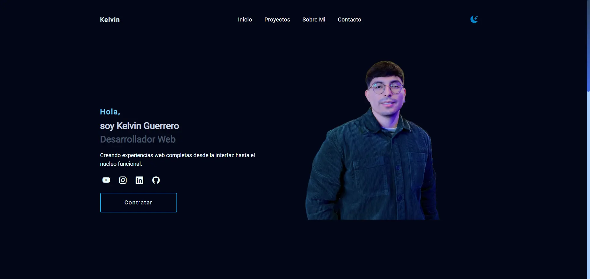

# 💼 Portfolio: Kelvin Guerrero 

## 📎[Visit here](https://kelvinguerrero.dev)

Starting the project in Development mode
```
npm run dev
```

> 🏠 **Home**



## 🚀 Project Structure

Inside of your Astro project, you'll see the following folders and files:

```
/
├── public/
│   └── favicon.svg
|   └── assets/
|        └── fonts/
|           └── Roboto-Regular.ttf
|   └── img/
|       └── digital_dreams.png
|       └── gym_verse.png
|       └── inicio.png
|       └── kelvin-ia.png
|       └── Kelvin.png
|       └── nameMyPet.png
├── src/
│   ├── components/
│   │   └── Header.astro
│   │   └── Job.astro
│   │   └── Project.astro
│   ├── layouts/
│   │   └── Layout.astro
│   └── pages/
│       └── index.astro
└── package.json
```

Astro looks for `.astro` or `.md` files in the `src/pages/` directory. Each page is exposed as a route based on its file name.

There's nothing special about `src/components/`, but that's where we like to put any Astro/React/Vue/Svelte/Preact components.

Any static assets, like images, can be placed in the `public/` directory.

## 🧞 Commands

All commands are run from the root of the project, from a terminal:

| Command                   | Action                                           |
| :------------------------ | :----------------------------------------------- |
| `npm install`             | Installs dependencies                            |
| `npm run dev`             | Starts local dev server at `localhost:3000`      |
| `npm run build`           | Build your production site to `./dist/`          |
| `npm run preview`         | Preview your build locally, before deploying     |
| `npm run astro ...`       | Run CLI commands like `astro add`, `astro check` |
| `npm run astro -- --help` | Get help using the Astro CLI                     |

## 👀 Want to learn more?

Feel free to check [our documentation](https://docs.astro.build) or jump into our [Discord server](https://astro.build/chat).
